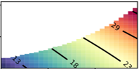
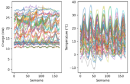
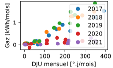

# Python pour l'Ingénieur.e - Outils pour l'analyse énergétique

## Comment accéder à un environnement python ?

- **Option flemme** : je travaille en ligne, je clique sur les tutos et un lien m'envoie vers google colab, où je pourrai tester le code (en revanche il faut disposer d'un compte gmail...)
- **Option install'** : je télécharge une bonne fois pour toute <a href="https://www.anaconda.com/download/">Anaconda<a>, c'est libre de droits et ça marche bien. Ensuite je lance *Jupyter Notebook (Anaconda 3)* depuis ma barre Windows et j'ouvre les fichiers *tuto_X.ipynb* ci-dessous, ou je copie colle les bouts de script dans l'éditeur de code *Spyder* (aussi installé avec Anaconda). Pas clair ? <a href="https://www.geeksforgeeks.org/how-to-install-anaconda-on-windows/">par ici<a>.

## Que contient ce dossier ?
Une série de tutos sur les fondamentaux, sous la forme de *jupyter notebooks*, que vous pouvez travailler en ligne, ou en les téléchargeant.
D'abord un bref tour d'horizon des bases :

- **<a href="https://github.com/eddes/INSA/blob/main/python/tuto_1.ipynb">Tuto \#1<a>** les bases de python : opérations, conditions, boucles, listes, fonctions
  
  
  
- **<a href="https://github.com/eddes/INSA/blob/main/python/tuto_2.ipynb">Tuto \#2<a>** manipuler des données : lire/écrire dans un fichier, faire quelques stats de base

  

Ensuite les applications dédiées, présentés sous la forme de blocs/boîtes-à-outil :

- **<a href="https://github.com/eddes/INSA/blob/main/python/tuto_integration.ipynb">Tuto \#3<a>** : réaliser une intégration numérique

    

- **<a href="https://github.com/eddes/INSA/blob/main/python/tuto_interpolation.ipynb">Tuto \#4<a>** : interpoler sur une série de données

  

- **<a href="https://github.com/eddes/INSA/blob/main/python/tuto_solve_equation.ipynb">Tuto \#5<a>** : résoudre une équation/un système d'équations

  

- **<a href="https://github.com/eddes/INSA/blob/main/python/tuto_fit_equation.ipynb">Tuto \#6<a>** : approximer des données mesurées par une courbe de tendance
  
  

- **<a href="https://github.com/eddes/INSA/blob/main/python/tuto_equa_diff.ipynb">Tuto \#7<a>** : intégrer une équation différentielle/un système d'équations différentielles

  

- **<a href="https://github.com/eddes/INSA/blob/main/python/tuto_7.ipynb">Tuto \#8<a>** : minimiser l'écart entre un modèle et des mesures par action sur les paramètres du modèle ("fitter" dans le jargon).
  
- **<a href="https://github.com/eddes/INSA/blob/main/python/tuto_meteostat.ipynb">Tutos "packages"<a>** : utilisation du package meteostat pour la récupération de fichiers météo
  
  

- **<a href="https://github.com/eddes/INSA/blob/main/python/tuto_n.ipynb">Tutos "packages"<a>** : utiliser des packages spécifiques pour le calcul de confort, la récupération de fichiers météo, le webscraping...
  
  
