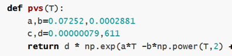

# Python pour l'Ingénieur.e - Outils pour l'analyse énergétique

## Comment accéder à un environnement python ?

- **Option install' Anaconda** : je télécharge une bonne fois pour toute <a href="https://www.anaconda.com/download/">Anaconda<a>, c'est libre de droits et ça marche bien. Ensuite je lance *Jupyter Notebook (Anaconda 3)* depuis ma barre Windows et j'ouvre les fichiers *tuto_X.ipynb* ci-dessous, ou je copie colle les bouts de script dans l'éditeur de code *Spyder* (aussi installé avec Anaconda). Pas clair ? <a href="https://www.geeksforgeeks.org/how-to-install-anaconda-on-windows/">par ici<a>. On évitera d'installer *Spyder* dans sa version en solo car l'ajout de packages est compliqué et que nous allons en faire quelques-uns !

- **Option install' Pyzo** : je télécharge le libre et léger <a href="https://pyzo.org/start.html">Pyzo<a>, c'est un environnement python uniquement (pas de notebooks). J'accède à l'éditeur pour exécuter le code et j'utilise `pip install lenomdupackage` pour installer les packages manquants.

- **Option flemme** (ok pour la première séance) : je travaille en ligne, je clique sur les tutos et un lien m'envoie vers google colab, où je pourrai tester le code (en revanche il faut disposer d'un compte gmail...). Attention, la sauvegarde est plus compliquée !

## Que contient ce dossier ?
Une série de tutos sur les fondamentaux, sous la forme de *jupyter notebooks*, que vous pouvez travailler en ligne, ou en les téléchargeant.
D'abord un bref tour d'horizon des bases :

- **<a href="https://github.com/eddes/INSA/blob/main/python/tuto_1.ipynb">Tuto \#1<a>** les bases de python : opérations, conditions, boucles, listes, fonctions
  
  
  
- **<a href="https://github.com/eddes/INSA/blob/main/python/tuto_2.ipynb">Tuto \#2<a>** manipuler des données : lire/écrire dans un fichier, faire quelques stats de base

  

Ensuite les applications dédiées, présentés sous la forme de blocs/boîtes-à-outil :

- **<a href="https://github.com/eddes/INSA/blob/main/python/tuto_dataframe.ipynb">Tuto dataframe<a>** : exploiter des données avec un dataframe

    

- **<a href="https://github.com/eddes/INSA/blob/main/python/tuto_integration.ipynb">Tuto intégration<a>** : réaliser une intégration numérique, pour un calcul d'énergie à partir d'une puissance

    

- **<a href="https://github.com/eddes/INSA/blob/main/python/tuto_interpolation.ipynb">Tuto interpolation<a>** : interpoler sur une série de données, par exemple pour combler des vides dans une mesure

  

- **<a href="https://github.com/eddes/INSA/blob/main/python/tuto_solve_equation.ipynb">Tuto résolution<a>** : résoudre une équation/un système d'équations

  

- **<a href="https://github.com/eddes/INSA/blob/main/python/tuto_fit_equation.ipynb">Tuto courbe de tendance<a>** : approximer des données mesurées par une courbe de tendance
  
  

- **<a href="https://github.com/eddes/INSA/blob/main/python/tuto_equa_diff.ipynb">Tuto équa diff'<a>** : intégrer une équation différentielle/un système d'équations différentielles

  

- **<a href="https://github.com/eddes/INSA/blob/main/python/tuto_minimize.ipynb">Tuto fit<a>** : minimiser l'écart entre un modèle et des mesures par action sur les paramètres du modèle ("fitter" dans le jargon).
  
  
  
- **<a href="https://github.com/eddes/INSA/blob/main/python/tuto_meteostat.ipynb">Tuto meteostat<a>** : utilisation du package meteostat pour la récupération de fichiers météo
  
  

- **<a href="https://github.com/eddes/INSA/blob/main/python/tuto_pyvista.ipynb">Tuto pyvista<a>** : utilisation du package pyvista pour le travail en géométrie 3D
  
  

- **<a href="https://github.com/eddes/INSA/blob/main/python/tuto_pvlib.ipynb">Tuto pvlib<a>** : utilisation du package pvlib pour la reconstitution des flux solaires direct et diffus sur un plan quelconque, à partir d'un fichier météorologique.
  
  

- **<a href="https://github.com/eddes/INSA/blob/main/python/tuto_geopandas.ipynb">Tuto geopandas<a>** : les packages geopandas/geoplot pour afficher des informations sur des cartes à partir d'un fichier geojson.
  
  
